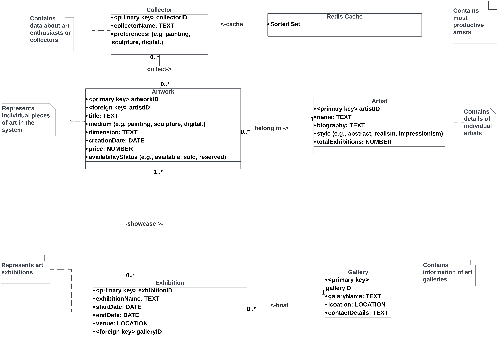

# CS5200Project3

## Requirement
The key requirement of Project3 is to enhance the system’s performance and data access speed. To achieve this, I will implement a Redis-based caching mechanism for artwork details. This will reduce the load on MongoDB database and provide faster data retrieval for end-users. See [requirements.pdf](./requirements.pdf) for details.

## UML


## Definition of data structures used in Redis
Artwork Details Caching

Data Structure: Hash

Each artwork’s details will be stored in a Redis hash.

The key for each artwork’s details will follow the pattern ‘artworkDetails: artworkID’

The hash will store fields such as ‘title’, ‘medium’, ‘dimension’, and ‘price’. Each field in the hash represents an attribute of the artwork.

See [definition of data structures](./definition%20of%20data%20structures.pdf) for details.

## APP
Node + Express application that can create, display, modify and delete `Artwork Details Caching` in Redis.

The user interface is in the localhost:3000/redis-cache page. Can be directed from the last navigation option in the home page.

README of the APP: [README-APP](./app/README.md)

```bash
# import the MongoDB data
mongoimport -d CS5200Project3 -c Artwork mongodb://localhost:27017 data/artwork.json --jsonArray
mongoimport -d CS5200Project3 -c Artist mongodb://localhost:27017 data/artist.json --jsonArray
mongoimport -d CS5200Project3 -c Collector mongodb://localhost:27017 data/collector.json --jsonArray
mongoimport -d CS5200Project3 -c Exhibition mongodb://localhost:27017 data/exhibition.json --jsonArray
mongoimport -d CS5200Project3 -c Gallery mongodb://localhost:27017 data/gallery.json --jsonArray

cd app
npm install
npm start
```
 
